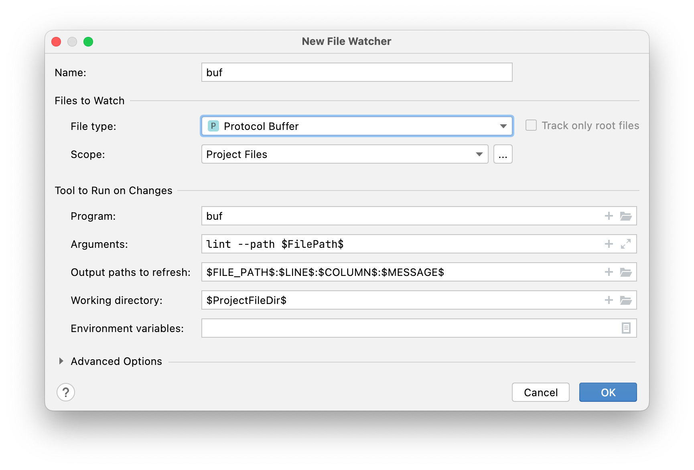
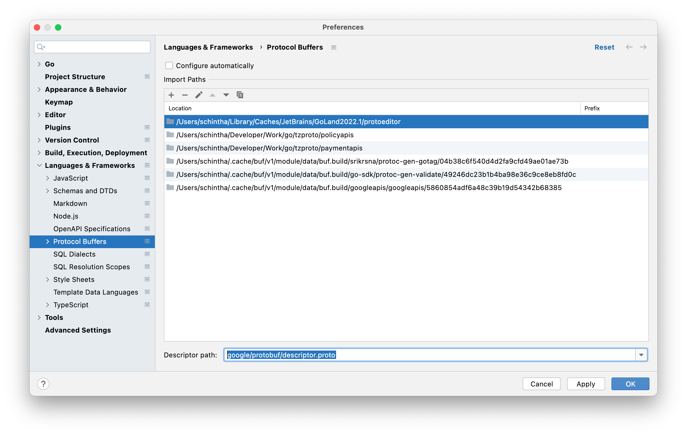

# Buf

[Buf](https://buf.build/) is a tool for __Protobuf__ files:

- [Linter](https://buf.build/docs/lint-usage) that enforces good API design choices and structure.
- [Breaking change detector](https://buf.build/docs/breaking-usage) that enforces compatibility at the source code or wire level
- Configurable file [builder](https://buf.build/docs/build-overview) that produces [Images](https://buf.build/docs/build-images) our extension of [FileDescriptorSets](https://github.com/protocolbuffers/protobuf/blob/master/src/google/protobuf/descriptor.proto)

## Prerequisites

```shell
# buf: proto tool https://buf.build/docs/tour-1
brew install bufbuild/buf/buf
# or use `go install` to install Buf
go install github.com/bufbuild/buf/cmd/buf@latest

# Install protoc plugins
go install google.golang.org/protobuf/cmd/protoc-gen-go@latest
go install google.golang.org/grpc/cmd/protoc-gen-go-grpc@latest
go install github.com/srikrsna/protoc-gen-gotag@latest
go install entgo.io/contrib/entproto/cmd/protoc-gen-entgrpc@latest

go install google.golang.org/protobuf/cmd/protoc-gen-go@latest
# Installing PGV can currently only be done from source: 
# from user's home directory, run
go get -d github.com/envoyproxy/protoc-gen-validate
cd ~/go/src/github.com/envoyproxy/protoc-gen-validate
git pull
make build
```

[Editor Integration](https://docs.buf.build/editor-integration) (Optional)

Add `Import Paths` and `google/protobuf/descriptor.proto` in **GoLand/IntelliJ** as described [here](https://github.com/jvolkman/intellij-protobuf-editor/issues/33#issuecomment-898466971) 👇 


## Developer Workflow

### Info

```shell
# To list all files Buf is configured to use:
buf ls-files
# To see your currently configured lint or breaking checkers:
buf mod ls-lint-rules
buf mod ls-breaking-rules
# To see all available lint checkers independent of configuration/defaults:
buf mod ls-lint-rules --all
```

### Build

```shell
# check
buf build -o /dev/null
buf build -o image.bin
```

### Lint

```shell
buf lint
# We can also output errors in a format you can then copy into your buf.yaml file
buf lint --error-format=config-ignore-yaml
# Run breaking change detection
# for dev local
buf breaking --against image.bin
buf breaking --against '.git#branch=main'
buf breaking --against '.git#branch=main,subdir=proto/dataapis'

# for CI
export HTTPS_GIT=https://github.com/xmlking/yeti.git
buf breaking --against "$(HTTPS_GIT)#branch=main"
```

### Generate

Cleanup
```shell
rm -rf gen
```

Generate
```shell
buf generate proto/dataapis
buf generate proto/demoapis
buf generate
# FIXME: https://github.com/bufbuild/buf/issues/560  
# WORKAROUND: https://github.com/srikrsna/protoc-gen-gotag/issues/26
buf generate --template buf.gen.tag.yaml
# to generate into custom directory i.e., `gen`
buf generate -o gen
# to generate from BSR 
buf generate buf.build/micro/demoapis -o gen/go
```

### Buf Modules
Buf support modules [dependencies](https://docs.buf.build/tour/add-a-dependency) and modules registry [BSR](https://docs.buf.build/bsr/overview)

#### Login to buf registry. 
This command will create `/Users/<username>/.netrc` file

```shell
# fill the username and token
export BUF_USER=sumanth
export BUF_API_TOKEN=
echo ${BUF_API_TOKEN} | buf registry login --username ${BUF_USER} --token-stdin
# to logout
buf registry logout
```

CI authentication
```shell
echo ${BUF_API_TOKEN} | buf registry login --username ${BUF_USER} --token-stdin
```
#### Create buf lock files
one-time-setup
```shell
cd proto/dataapis
buf mod update
cd proto/demoapis
buf mod update
```
This will pull deps into `$HOME/.cache/buf`

#### Create a Repository
```shell
buf beta registry repository create buf.build/micro/dataapis --visibility public
buf beta registry repository create buf.build/micro/demoapis --visibility public

buf beta registry repository create buf.build/micro/myapis --visibility private
```

#### List Modules
```shell
buf beta registry repository list  buf.build --page-size 100
buf beta registry repository get    buf.build/googleapis/googleapis
```

#### Push the Module
```shell
cd proto/dataapis
buf push
cd proto/demoapis
buf push
# Create a tagged commit from the CLI with the command:
buf push --tag <TAG_NAME>
```

### Format

```shell
# FIXME buf don't have proto formatter yet 
prototool format -w proto;
```

## Tools

### grpcurl

```shell
# To use Buf-produced FileDescriptorSets with grpcurl on the fly:
grpcurl -protoset <(buf build -o -) ...
```

### ghz

```shell
# To use Buf-produced FileDescriptorSets with ghz on the fly:
ghz --protoset <(buf build -o -) ...
```

## Reference

1. [Style Guide](https://buf.build/docs/style-guide)
2. [Buf docs](https://buf.build/docs/introduction)
3. [Buf Example](https://github.com/bufbuild/buf-example/blob/master/Makefile)
4. [Buf Schema Registry](https://buf.build/docs/roadmap)
5. [Why adopt ProtoBuf](https://itnext.io/a-minimalist-guide-to-protobuf-1f24fbca0e2d)
6. [Buf, gRPC, gRPC-Web,Svelte UX](https://www.polarsignals.com/blog/posts/2022/02/22/how-we-build-our-apis-from-scratch/)
