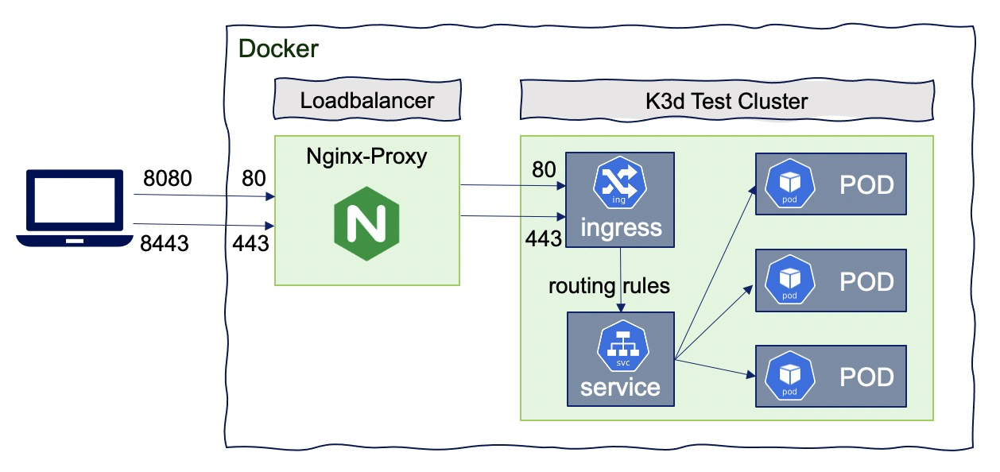

# k3d

Running k3d on macOS is very simple. Below is a quick recipe.

<p align="center">
  
</p>

## Prerequisite

Docker Desktop

```bash
# install `docker for mac`
brew cask install docker
# then go to the gui launcher and start up docker, and follow the prompts.
# uninstalling `docker for mac`
brew cask zap docker
```

## Install

```bash
brew install k3d
```

## Setup

Create a cluster

```bash
# Creating single-node test cluster (default: k3s-default)
k3d cluster create

# Creating multi-node test cluster (default: k3s-default)
k3d cluster create \
  --api-port 6443 \
  --servers 1 \
  --agents 3 \
  --port 443:443@loadbalancer
  
# `Configuration-as-Code` model
k3d cluster create --config config/k3d.yml
```

Verify cluster

```bash
k3d cluster list
k3d registry list
k3d node list
```

And voila that is it!

Delete cluster

```bash
k3d cluster delete
```

## Usage

```bash
k3d cluster start
k3d cluster stop
k3d cluster delete
```

### Loading

> Loading an Image Into Your Cluster

```bash
k3d image import entity-service:1.6.5-SNAPSHOT
```

### Verify

```bash
kubectl cluster-info
kubectl get nodes,all
kubectl top node

# Get the KUBECONFIG file and export it to your environment
k3d kubeconfig get k3s-default
# Verify your cluster is running
kubectl get pods --all-namespaces

# deploy image from internal registry 
kubectl create deployment entity-service --image=entity-service:1.6.5-SNAPSHOT
kubectl delete deployment entity-service
# deploy image from external registry loading dynamically
kubectl create deployment account --image=ghcr.io/xmlking/micro-starter-kit/account-srv:v0.3.1
kubectl delete deployment account
# deploy image from internal registry
kubectl create deployment nginx --image=k3d-registry.localhost:5000/nginx:latest
kubectl delete deployment nginx
```

## Reference

- [K8s on macOS with K3s, K3d and Rancher](https://habd.as/post/kubernetes-macos-k3s-k3d-rancher/)
