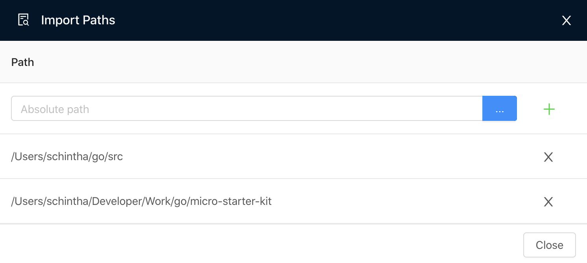
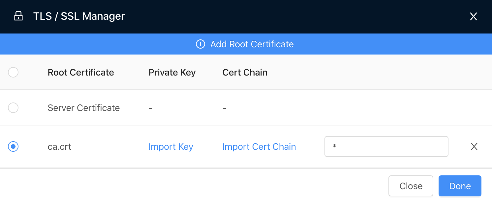
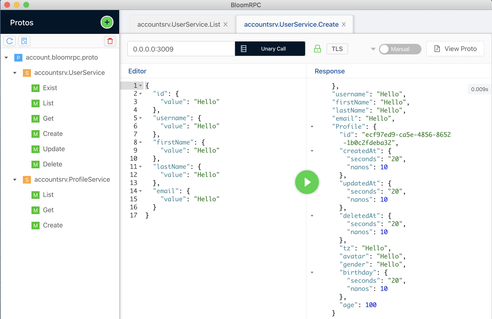

BloomRPC

> **BloomRPC** is a UI client for testing gRPC services.

### Prerequisites

```bash
# install `bloomrpc` via `brew` into ~/Applications)
brew install --cask --appdir=~/Applications bloomrpc
# gRPC mock server for testing (optional)
npm i bloomrpc-mock -g
```

> Assume you generated `TLS` certs as per [mtls](../../config/certs/README.md) and running `Account` gRPC microservice locally, Or
> started mock gRPC service using [bloomrpc-mock](mock.md)

### Using BloomRPC Client

1. Import paths by clicking `🔎 Import paths` icon

   

2. Import _protos_ by clicking `🟢 Import Protos` icon and
   adding `e2e/account.bloomrpc.proto`

   Select any `[service].[method]` to test, make sure the `Port` is correct, and click `TLS` button and add CA Cert.

3. Add Root CA cert.

   Click `+ Add Root Certificate` button and add `config/certs/upstream-ca-cert.pem` file
   

   Add `localhost` for `ssl target host` input field.

4. Call the service's method

   Create:
   

